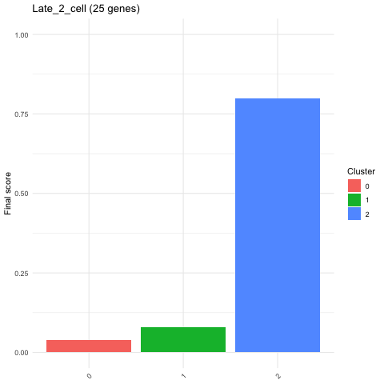
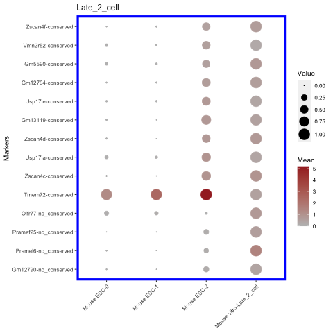
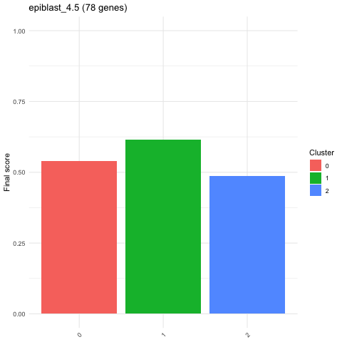
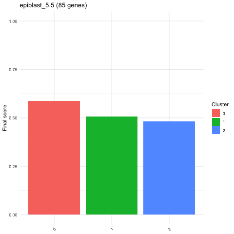
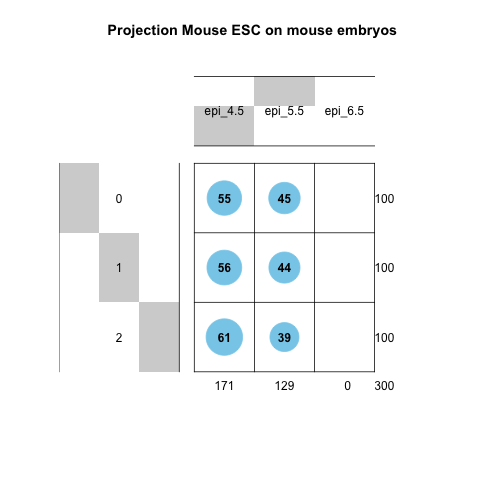

# Summary
In the last decade the size of datasets generated with single cell RNA sequencing technique has grown exponentially. Large references, like the human cell atlas, with annotated cell types, are nowadays available [@HUMAN2017]. 
Efficient tools are essential in order to characterize a cell c from a newly generated dataset in quick and robust way, by projecting the new (query) dataset into an existing reference dataset. 
Several tools were developed in the last years to address this task [@SCMAP2018; @SCIBET2020; @SEURAT2019]. However, while they perform well if the similar cell types are present in both reference and query, they tend to fail if a cell type is only in the query but not in the reference. The main reason is that these methods predict always a label for the query cell, even if it is from cell type not included in the reference.
Moreover the features (genes) that are in common between the reference cluster and the query cell that lead to the labelling are not given as output. 
Here we propose SCOPRO (SCOre PROjection), an R library that assigns an absolute score (from 0 to 1) between each cluster in the query dataset and a given cluster in the reference dataset.  The score is given by the fraction of genes that are conserved between the query and the reference cluster.
Since is bounded between 0 and 1, the score is comparable across clusters and does not depend on the clusters included in the reference dataset. 

# Statement of need
As more and more new datasets are generated with single cell RNA sequencing technique, it has become crucial to compare the new datasets with already existing and annotated references. In the last years, several tools were developed to perform label transfer from a reference to a query dataset. 
Among the most popular ones there are Seurat, SciBet and scmap [@SEURAT2019; @SCIBET2020; @SCMAP2018]. They are all implemented in an R package.
Seurat[@SEURAT2019] is based on the idea of using anchors between query and reference.  Anchor is a cells pair (one from query, one from reference) made up of mtual nearest neighbors[@MNN2018] found in a shared low dimensional embedding. 
Once the anchors are identified, the annotation of each cell in the query set is achieved using a weighted vote classifier based on the reference cell identities. So for each query cell a quantitative score for every cluster in the reference dataset is given.
In SciBet[@SCIBET2020], first a features selection process is done for each cell types in the reference with E-test. Then a multinomial model is built (one for each cell type in the reference). The parameters of the distribution are computed starting from the normalized expression of the selected features. The query cell is annotated with the cell type in the reference that maximized the likelihood function.
Scmap[@SCMAP2018] identifies for each query cell the closest cluster in the reference (represented with a centroid given by a vector of the median value of the expression of each gene) with nearest neighbor approach. 
The Similarities between the query cell and the closest reference cluster are computed using cosine similarity and Pearson and Spearman correlations. If at least two of the similarities are in agreement, and if at least one is above 0.7, then the query cell is labelled as the closest reference cluster. Otherwise the cell is labelled unassigned.
Seurat and scmap assign a quantitative score to each of the query cell. However this quantitative score depends on the clusters included in the reference dataset.  On the contrary SciBet returns as output only the predicted label of the query cell, but not a quantitative score. 
For all the three methods the labelling show simply to which cluster in the reference the query cell is closer to, but not how much the query cell is similar to the reference.
Another limitation of the previous methods is that the common genes that drive the labelling of the query cell are not given as output.
To overcome these limitations, we develop SCOPRO (SCOre PROjection), an R package that assigns a score projection from 0 to 1 between a given cluster in the reference and each single cluster from a query dataset. The score is assigned based on the fraction of specific markers of the reference cluster that are conserved in the query cluster.
The first step is to select as features only the markers of the reference clusters with a median above a given threshold in one cluster and below this threshold in all the other clusters.
For a given cluster, a connectivity matrix is computed with number of rows and number of columns equal to the number of the selected markers. Each entry (i,j) in the matrix can be 1 if the fold change between gene i and gene j is above a given fold change. Otherwise is 0. Finally the connectivity matrix of the reference cluster and all the clusters in the query dataset are compared. A gene i is considered to be conserved between a reference cluster and a query cluster if the jaccard index of the links of gene i is above a given threshold.
SCOPRO returns as output a score between 0 and 1 that rely only on the fraction of conserved genes between the reference and the query clusters, but not on which clusters are included in the reference. For this reason, the score from SCOPRO can be interpreted as an attempt to provide an absolute measure of similarity between query and reference clusters, differently from the output of the previous methods.
In addition SCOPRO provides as output the genes that are conserved between query and reference dataset. These genes are relevant because they are responsible for the final score.

# Key functions

The two main functions of SCOPRO are:

1. 'SCOPRO': It takes as input the normalized count matrix of the query and reference datasets, the unsupervised cluster assignment for the query, the selected reference cluster for which we want to compute the score and the features (markers genes) from the reference. The output returns by SCOPRO is a list including the score and the conserved genes between each query cluster and the given reference 

2. 'cluster.plot_score': It takes as input the output of SCOPRO and it returns the score between each query clusters and the reference.

3. 'plot_score_genes': it returns a balloon plot with the conserved and not conserved genes between a given reference cluster and the query clusters. 

In SCOPRO package are also implemented wrapper functions for popular R based projection tools (Seurat, SciBet and scmap). These wrapper functions are built in order that their output is perfectly integrable with other SCOPRO functions   This has the advantage of having in one, easy to use library several methods that can be used for a comparison with the output of SCOPRO. 
As example to show how SCOPRO works we used as reference a dataset from mouse embryo development (in vivo dataset)[@DENG2014; @MOHAMMED20171215] including stage 2-cells stages and epiblast stages (from 4.5 to 6.5). As query we used a mouse embryonic stem cells dataset (in vitro dataset)[@ITURBIDE2021].
We run SCOPRO selecting as reference cluster the late 2-cells stage. 
We noticed that the query cluster 2 has a very high score for late 2-cells stage, while the score for cluster 0 and 1 is very low (**figure 1**).
Interestingly among the conserved markers between cluster 2 and the late 2-cells stage there are Zscan4 family genes (**figure 2**).  It is known that in mouse embryonic stem cells, a rare population of cells with typical markers of late 2-cells stage including Zscan4 genes is present. This population is called 2 cells like cells (2CLC)[@TERRONES2018; @MCFARLAN2012]. Therefore cluster 2 in our query dataset is the 2CLC.

{ width=60%}

{ width=60%}

The advantage of SCOPRO in comparison with other published methods is that it assigns a score that does not depend on the clusters present in the refence dataset.
Starting from the same query, we run again SCOPRO and Seurat but this time removing from the reference dataset the cluster late 2 cells stage.
If only epiblast stages from 4.5 to 6.5 are used, then Seurat will still assign cluster 2 to epiblast 4.5 and epiblast 5.5 (**figure 3**, **figure 4**), although this cluster shares just a few markers with these reference stages.
On the other hand, SCOPRO correctly assigns a low score (below 0.5) in cluster 2 for both epiblast 4.5 and epiblast 5.5 (**figure 5**).

{ width=60%}

{ width=60%}

{ width=60%}

# References

